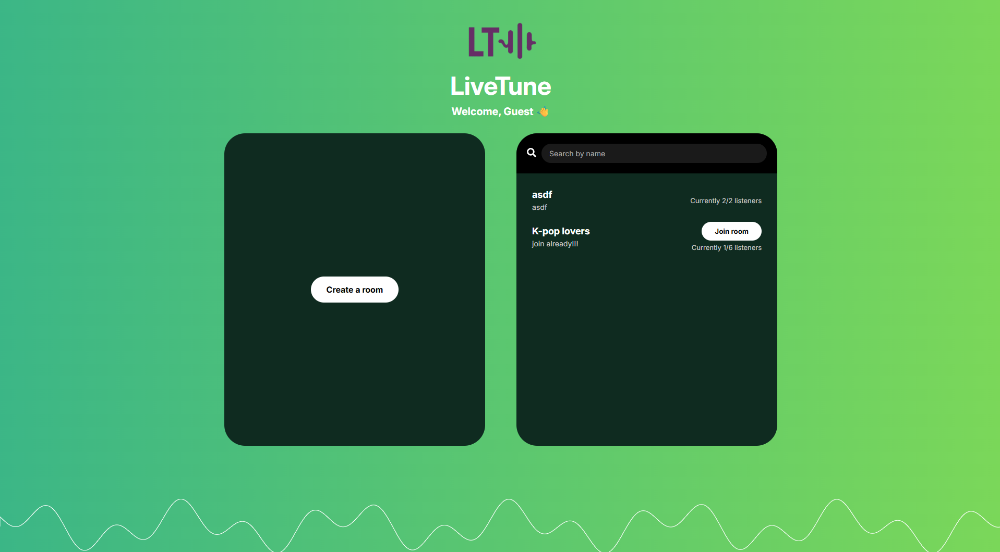

# 🎵 LiveTune Front-end

**LiveTune Front-end** 레포지토리에 오신 것을 환영합니다!  
이 프로젝트는 LiveTune 앱의 프론트엔드 로직을 포함합니다.
[Go to english README](../README.md)



## 📚 목차

- [📖 소개](#-소개)
- [🚀 프로젝트 실행 방법](#-프로젝트-실행-방법)
- [📝 기여 가이드라인](#-기여-가이드라인)

---

## 📖 소개

이 레포지토리는 LiveTune 플랫폼의 프론트 엔드 파트의 코드를 다루고 있습니다.

### 🎧 LiveTune 프로젝트

**LiveTune**은 친구들과 실시간으로 음악을 함께 들을 수 있는 웹 애플리케이션입니다. 친구들이 어디에 있든지 상관없이, 마치 같은 공간에 있는 것처럼 모든 사용자에게 음악이 **완벽하게 동기화**되어 재생됩니다.

함께 시간을 보내거나, 공부하거나, 그냥 편하게 음악을 즐기고 싶을 때, LiveTune은 모두가 **같은 순간에 같은 노래를 듣도록** 보장해줍니다. 여기에 **채팅 기능**, **공유 재생 목록**, 그리고 매력적인 UI가 더해져, 실시간 소셜 음악 경험을 완성합니다.

---

## 🚀 프로젝트 실행 방법

다음 항목들이 설치되어있는지 확인해주세요:

- [Node.js](https://nodejs.org/)와 npm 설치 (v22.14.0 이상)

1. 해당 레포지토리를 클론합니다.

   ```bash
   git clone git@github.com:Live-Tune/LiveTune-fe.git
   cd LiveTune-fe
   ```

2. 라이브러리와 종속 패키지를 설치합니다.

   ```bash
   npm install
   ```

3. 개발용 서버를 실행합니다.

   ```bash
   npm run dev
   ```

4. 브라우저를 열어 local에서 배포되는 웹사이트에 접근하세요. e.g. [http://localhost:5173](http://localhost:5173)

---

## 📝기여 가이드라인

프로젝트에 대한 의견이 있으신가요?

이슈 페이지에 여러분의 생각을 자유롭게 남겨주세요.

다음과 같은 항목들을 고려해 프로젝트에 기여하실 수 있습니다.

| 카테고리        | 항목                                                                             |
| --------------- | -------------------------------------------------------------------------------- |
| **디자인 개선** | - 폰트 스타일<br>- 배경 색상<br>- 배경 웨이브 스타일<br>- 전반적인 UI 및 UX 개선 |
| **누락된 기능** | - 실시간 시간 동기화<br>- 채팅 기능<br>- 음악 큐 기능<br>- 사용자 목록 표시      |
| **성능 최적화** | - 코드 효율성 개선<br>- 로딩/렌더링 시간 단축<br>- 네트워크 요청 최적화          |

프로젝트에 기여를 고려하고 계신다면, [기여 가이드라인](./CONTRIBUTING_ko.md)을 확인해주세요.
